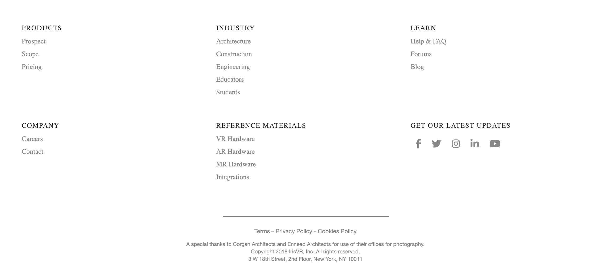
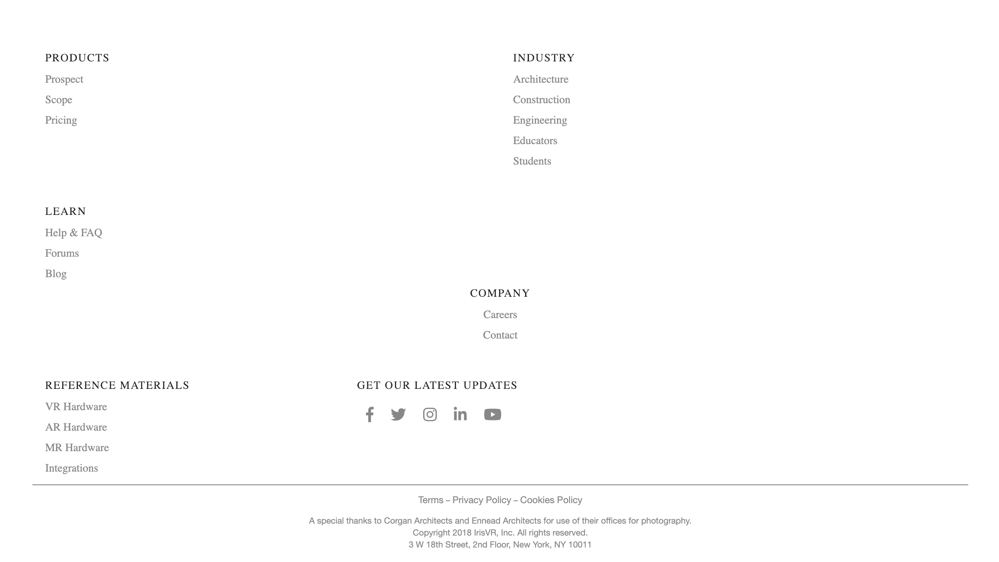

This repo minimally reproduces the bug detailed 
[here](https://github.com/gatsbyjs/gatsby/issues/5667#issuecomment-448753769).

Here's what the footer should look like on initial load.

Here's what the footer looks like when I initially load Chrome in a non-cached, incognito window.

